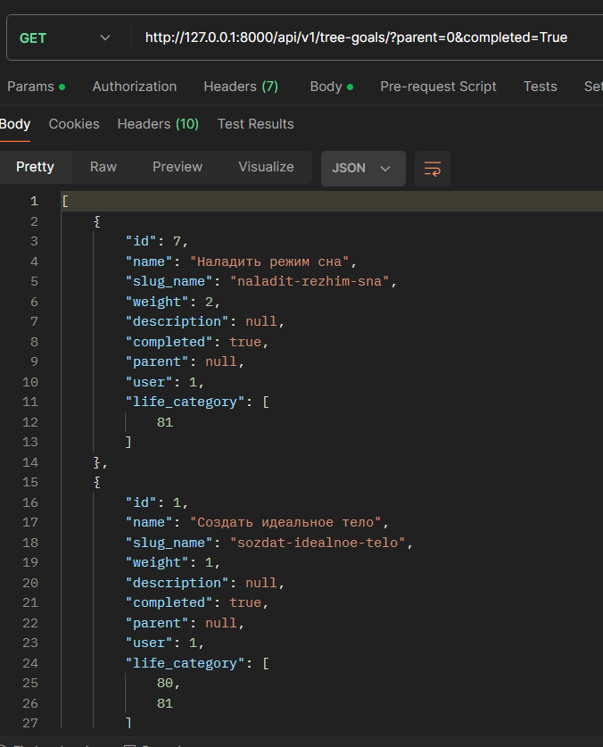
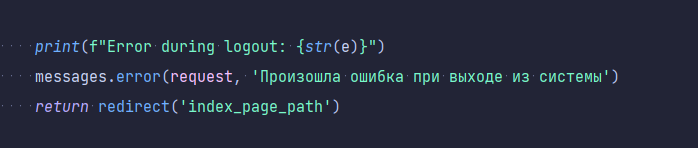

# AcentFlowHub
Основная концепция этого веб-приложения может быть описана как сочетание социальной сети и менеджера целей с акцентом на личное развитие.

## Структура Проекта
    AscentFlowHub_API - Апи для работы с общеми моделями приложения
    AscentFlowHub_web - Вэб приложение
    Сonstants - Папка для относительно небольших и редкоменяющихся данных 

Описание структуры проекта.

## Требования и Зависимости

Django
DRF
Djoser

## Документация

### Создание всплывающих сообщений
Реализовано через from django.contrib import messages
#### Типы сообщений:
Присутствуют стандартные типы сообщений из messages.
    success - Успешные сообщений
    info - Нейтральные сообщения
    warning - Предупреждающие
    error - Сообщения об ошибках

Для вывода сообщений есть бок html кода в AscentFlowHub/templates/base.html и стили для этого блока, а так же для каждого типа
сообщений в AscentFlowHub/static/css/base.css

Что бы создать сообщение достаточно во вьюхе вызвать message.тип_сообщения. Пример:

### Модальное окно

### Модели

1. User - Стандартная Django модель пользователя
2. LifeCategoryModel - Модель сфер жизни пользователя. Представляет собой модель для построения графиков прогресса
пользователей. Поля модели: Название, латинская транскрипция, два цвета для визуализации индивидуальности графиков, поле
user для связи с моделью пользователя
3. UserTrainingModel - Представляет собой модель обучения вэб интерфейсу сайта.

### API

Default URL: 'api/v1/

Доступ к API происходит при отправке токена пользователя в заголовках:  headers={'Authorization': user_token}

Доступны все стандартные эндпоинты djoser для работы с токеном и аккаунтом пользователя.
Для доступа к эндпоинтам djoser добавляем к Default URL '/auth/': 'api/v1/auth/'

**Управление моделью LifeCategoryModel через API происходит через эндпоинт**: '/api/v1/life-category/'

## Вклад и Авторство

Автор проекта Геронимус Евгений Михайлович

## Контактная Информация

telegram: https://t.me/Grimjo777
